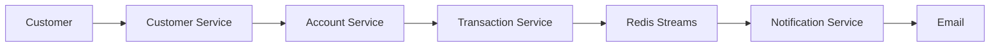

# Cloud-Native Banking Notification Platform

## Architecture



## Overview

A production-inspired event-driven banking platform built using Java, Spring Boot, PostgreSQL, Redis Streams, Docker, and Microservices Architecture.

The platform demonstrates modern distributed system patterns including:

* Microservices Architecture
* Event-Driven Design
* Transactional Outbox Pattern
* Redis Streams Messaging
* OpenFeign Service Communication
* PostgreSQL Persistence
* Docker Containerization
* Email Notifications
* Swagger/OpenAPI Documentation
* Prometheus Monitoring
* Grafana Dashboards

---

## Architecture

```text
Customer Service
        │
        ▼
Account Service
        │
        ▼
Transaction Service
        │
        ▼
Outbox Events
        │
        ▼
Redis Streams
        │
        ▼
Notification Service
        │
        ▼
Email Notifications
```

---

## Technology Stack

### Backend

* Java 21
* Spring Boot 3
* Spring Data JPA
* Spring Validation
* Spring Mail
* Spring OpenFeign
* Spring Actuator

### Database

* PostgreSQL 17

### Messaging

* Redis Streams

### Documentation

* OpenAPI 3
* Swagger UI

### Monitoring

* Prometheus
* Grafana

### Containerization

* Docker
* Docker Compose

---

## Microservices

### Customer Service

Port: 8081

Responsibilities:

* Customer Registration
* Customer Search
* Customer Profile Management

Endpoints:

POST /api/customers

GET /api/customers/{id}

GET /api/customers

Swagger:

http://localhost:8081/swagger

---

### Account Service

Port: 8082

Responsibilities:

* Account Creation
* Balance Management
* Deposit
* Withdraw
* Transfer
* Freeze Account
* Close Account

Endpoints:

POST /api/accounts

GET /api/accounts/{id}

POST /api/accounts/{id}/deposit

POST /api/accounts/{id}/withdraw

POST /api/accounts/transfer

Swagger:

http://localhost:8082/swagger

---

### Transaction Service

Port: 8083

Responsibilities:

* Deposit Transactions
* Withdraw Transactions
* Transfer Transactions
* Fraud Detection
* Transaction History
* Outbox Pattern

Endpoints:

POST /api/transactions/deposit

POST /api/transactions/withdraw

POST /api/transactions/transfer

Swagger:

http://localhost:8083/swagger

---

### Notification Service

Port: 8084

Responsibilities:

* Consume Redis Events
* Store Notification History
* Send Email Notifications

Endpoints:

GET /api/notifications

Swagger:

http://localhost:8084/swagger

---

## Project Structure

```text
banking-notification-platform

docs/
├── architecture
├── diagrams
└── ADR

services/
├── customer-service
├── account-service
├── transaction-service
└── notification-service

common/
├── event-library
└── shared-models

infra/
├── docker
├── terraform
└── kubernetes

monitoring/
├── prometheus
└── grafana

.github/
└── workflows
```

---

## Database Setup

Create databases:

```sql
CREATE DATABASE customerdb;
CREATE DATABASE accountdb;
CREATE DATABASE transactiondb;
CREATE DATABASE notificationdb;
```

Verify:

```sql
\l
```

---

## Redis Setup

Run Redis:

```bash
docker run \
--name redis \
-p 6379:6379 \
-d redis:7
```

Verify:

```bash
docker exec -it redis redis-cli
```

```bash
PING
```

Expected:

```text
PONG
```

---

## MailHog Setup

Run MailHog:

```bash
docker run -d \
--name mailhog \
-p 1025:1025 \
-p 8025:8025 \
mailhog/mailhog
```

Mail UI:

http://localhost:8025

---

## Running Services

Customer Service

```bash
cd services/customer-service
mvn spring-boot:run
```

Account Service

```bash
cd services/account-service
mvn spring-boot:run
```

Transaction Service

```bash
cd services/transaction-service
mvn spring-boot:run
```

Notification Service

```bash
cd services/notification-service
mvn spring-boot:run
```

---

## Event-Driven Flow

1. User performs deposit.
2. Account Service updates balance.
3. Transaction Service stores transaction.
4. Outbox event created.
5. Scheduler publishes event.
6. Redis Stream receives event.
7. Notification Service consumes event.
8. Email notification generated.

---

## Transactional Outbox Pattern

The Transaction Service implements the Transactional Outbox Pattern.

Benefits:

* No lost events
* Reliable message delivery
* Database consistency
* Event replay support

Tables:

transactions

outbox_events

---

## Redis Streams

Stream Name:

```text
bank-events
```

Inspect stream:

```bash
XRANGE bank-events - +
```

---

## Monitoring

### Prometheus

URL:

http://localhost:9090

### Grafana

URL:

http://localhost:3000

Credentials:

admin/admin

---

## API Documentation

Customer Service

http://localhost:8081/swagger

Account Service

http://localhost:8082/swagger

Transaction Service

http://localhost:8083/swagger

Notification Service

http://localhost:8084/swagger

---

## Future Enhancements

* Kubernetes Deployment
* AWS ECS Fargate
* AWS SES Email
* AWS SNS SMS
* WhatsApp Integration
* OpenTelemetry
* Jaeger Tracing
* Kafka Migration
* Terraform Infrastructure
* GitHub Actions CI/CD

---

## Author

Rejeena Banu

Principal Consultant

Java | Spring Boot | Microservices | AWS

---

## License

MIT License
