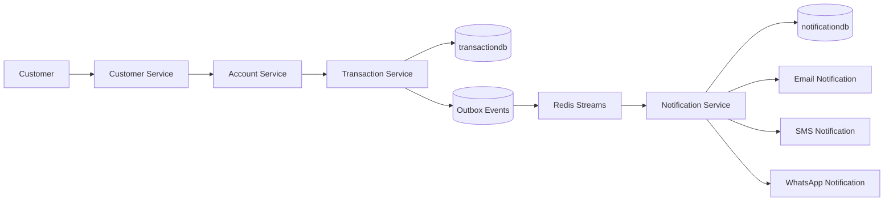

# Banking Notification Platform Architecture

```mermaid
flowchart LR

    CUSTOMER[Customer]

    CUSTOMER --> CS[Customer Service]

    CS --> AS[Account Service]

    AS --> TS[Transaction Service]

    TS --> DB1[(transactiondb)]

    TS --> OUTBOX[(Outbox Events)]

    OUTBOX --> REDIS[Redis Streams]

    REDIS --> NS[Notification Service]

    NS --> DB2[(notificationdb)]

    NS --> EMAIL[Email Notification]

    NS --> SMS[SMS Notification]

    NS --> WHATSAPP[WhatsApp Notification]
```