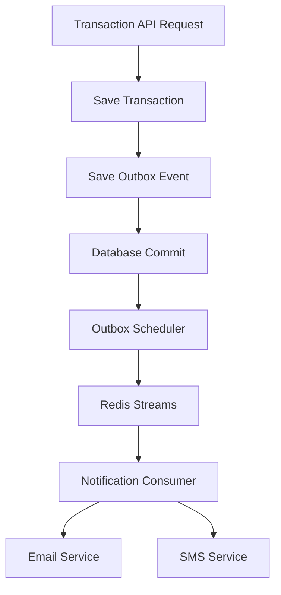

# Transactional Outbox Pattern

```mermaid
flowchart TD

    API[Transaction API Request]

    API --> DB[Save Transaction]

    DB --> OUTBOX[Save Outbox Event]

    OUTBOX --> COMMIT[Database Commit]

    COMMIT --> SCHEDULER[Outbox Scheduler]

    SCHEDULER --> REDIS[Redis Streams]

    REDIS --> CONSUMER[Notification Consumer]

    CONSUMER --> EMAIL[Email Service]

    CONSUMER --> SMS[SMS Service]
```